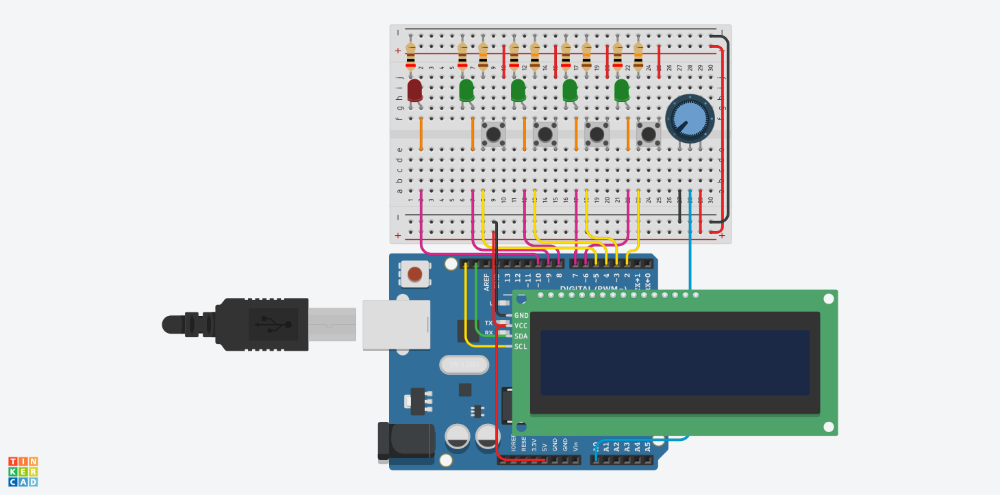
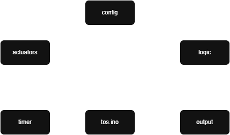

# Turn on the Sequence
This project demonstrates how to control a sequence of LEDs using an Arduino UNO, buttons, and a potentiometer. The setup also includes an LCD I2C display to provide real-time feedback. 



## Why These Resistor Values?

### LED Resistors (200Ω)
The 200Ω resistors are used in series with each LED to limit the current and prevent damage. The calculation is based on Ohm’s Law:

- **Arduino output voltage (V<sub>out</sub>)**: 5V  
- **LED forward voltage (V<sub>f</sub>)**: ~2V (typical for green/red LEDs)  
- **Desired current (I)**: ~15mA (safe for Arduino pins and LEDs)

Calculation:
```
R = (Vout - Vf) / I = (5V - 2V) / 0.015A ≈ 200Ω
```
This value ensures each LED receives enough current to be bright, but not so much as to risk damage.

### Button Pull-down Resistors (10kΩ)
The 10kΩ resistors are used as pull-downs for the push buttons to ensure a stable LOW signal when the button is not pressed. This value is a common choice because it provides a strong enough pull-down without drawing unnecessary current from the circuit.

## Software Schemas
The following diagram illustrates the dependencies among the various modules in the project.
The relationship shown is a UML dependency, indicating that one file includes another via #include.

- **tos.ino** is the main file and depends on all other modules.
- **config.h** provides configuration parameters and shared constants used across modules.

<div style="display: flex; align-items: center; justify-content: center; gap: 20px; flex-wrap: wrap; width:80%">

  <div style="flex: 1; min-width: 250px;">
    <p><strong>Each module is responsible for a specific functional part of the game:</strong></p>
    <ul>
      <li><b>logic.h:</b> game logic (state, sequence, score)</li>
      <li><b>actuators.h:</b> control of actuators (LEDs and buttons)</li>
      <li><b>output.h:</b> user output and display messages</li>
      <li><b>timer.h:</b> timer management and timeouts</li>
    </ul>
  </div>

  <div style="flex: 1; min-width: 250px; text-align: center;">
    
  </div>

</div>
